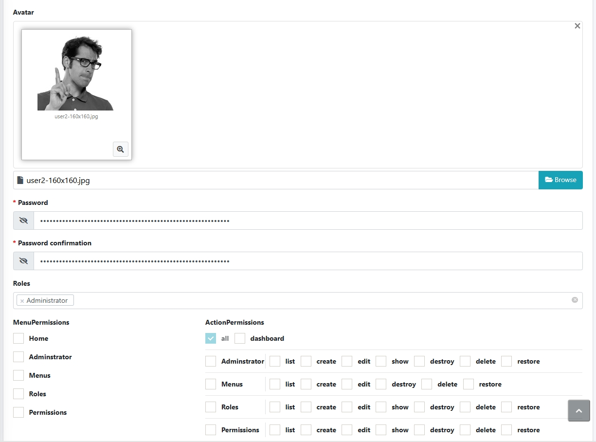

# authorize extension for laravel-admin 2.x

> 如果出现语言翻译问题，请添加对应翻译即可

## 预览图
> 如果无法显示预览图，请搜“GitHub无法显示图片”解决



## Installation

```shell
composer require laravel-admin-utils/authorization
```

Publish resources：

```shell
php artisan vendor:publish --provider="Elegant\Utils\Authorization\AuthorizeServiceProvider"
```

Initialization data

```shell
php artisan authorize:init
```

> `超级管理员` 拥有所有权限，并且所有的菜单对其可见。


打开`http://localhost/roles`管理角色

在用户模块`http://localhost/administrators`可以给用户添加角色。

## 用法

### 设置路由别名（非常重要，非常重要，非常重要）

在`app/Admin/routes.php`中，给路由设置别名

```php
// 将会生成 `首页` 路由权限
$router->get('/', 'HomeController@index')->name('home');
// resource资源路由，将自动生成`列表`、`新增`、`编辑`、`删除`路由权限，其中新增包含（`创建`、`保存`），编辑包含（`编辑`、`更新`）
$router->resource('users', 'UserController')->names('users');
// 如果希望多个路由在一个分组下面，可以使用下面的方法，会生成恢复权限
$router->put('users/{user}/restore', 'UserController@restore')->name('users.restore');
```

### Action通过路由访问控制（推荐使用方式二）

如果你使用了laravel-admin的actions，并希望进行访问控制，这里以用户的 `复制操作` 为例

- 路由已创建

- 创建action `app/Admin/Actions/Replicate.php`
  ```php
  namespace App\Admin\Actions\Users;
  
  use Elegant\Utils\Actions\Response;
  use Elegant\Utils\Actions\RowAction;
  use Illuminate\Database\Eloquent\Model;
  use Illuminate\Support\Facades\DB;
  
  class Replicate extends RowAction
  {
      /**
       * 设置路由请求方法
       * @var string
       */
      protected $method = 'POST';
  
      /**
       * 操作名称
       * @return array|null|string
       */
      public function name()
      {
          return '复制';
      }
  
      // 二选一
      //========================如果需要权限判断，请添加此方法===========================
      /**
       * 设置路由请求路径
       * @return string
       */
      public function getHandleUrl()
      {
          // 这里请仔细
          return $this->parent->resource().'/'.$this->getKey().'/replicate';
      }
      
      //============如果不需要权限判断或者在这里进行逻辑处理，请添加此方法=================
      /**
       * @param Model $model
       *
       * @return Response
       */
      public function handle(Model $model)
      {
          try {
              DB::transaction(function () use ($model) {
                  $model->replicate()->save();
              });
          } catch (\Exception $exception) {
              return $this->response()->error('复制失败！: {$exception->getMessage()}');
          }
  
          return $this->response()->success('复制成功！')->refresh();
      }
      
      /**
       * @return void
       */
      public function dialog()
      {
          $this->question('确认复制？');
      }
  }
  ```

- 创建自定义路由方法
  ```php
  
  use Elegant\Utils\Http\Controllers\HandleController;
  
  class UserController extends AdminController
  {
      // 二选一
      public function replicate($id)
      {
          //一：如果需要权限判断，在这里进行逻辑处理
          try {
              $model = User::withTrashed()->find($id);
              DB::transaction(function () use ($model) {
                  $model->replicate()->save();
              });
          } catch (\Exception $exception) {
              return $this->response()->error("复制失败！: {$exception->getMessage()}")->send();
          }
          return $this->response()->success('复制成功！')->refresh()->send();

          //二：如果不需要权限判断，去Replicate逻辑处理
          //return $this->handleAction();
      }
  }
  ```

### 关于Switch开关权限

由于laravel-admin本身的switch操作属于更新操作，无法单独判断权限

这里提供另外一种action方式实现switch操作权限控制，请参考 [这里](https://laravel-admin.org/docs/zh/2.x/model-table-column-display#列操作)
